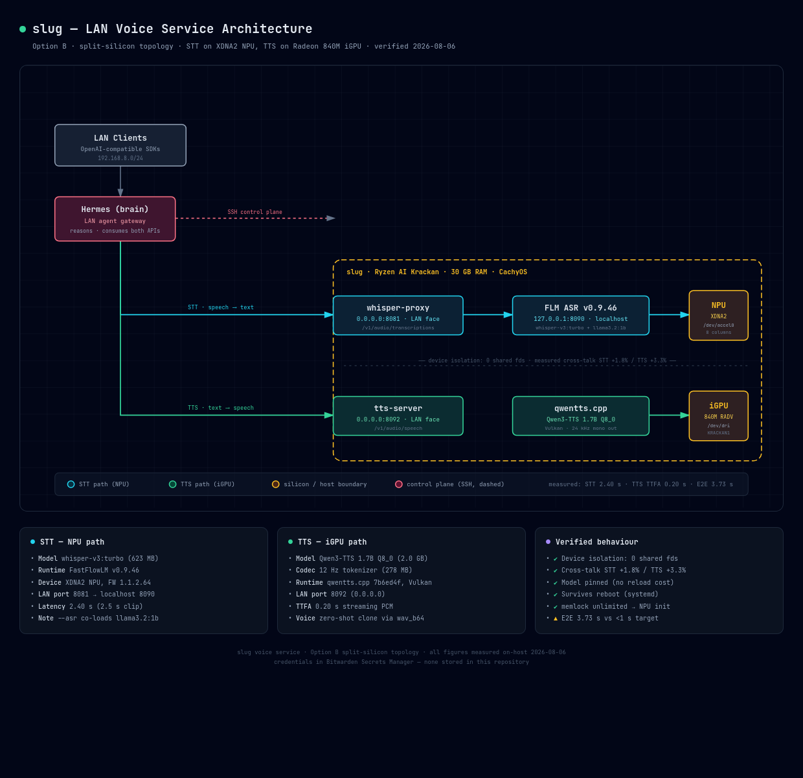

# slug-tts-stt

Always-on LAN **voice service** on a single AMD Ryzen AI ("Krackan") mini-PC: speech-to-text
and text-to-speech served as two OpenAI-compatible HTTP endpoints, deliberately split across
**two different accelerators** so the two workloads never contend for the same silicon.

* **STT** → AMD **XDNA2 NPU** via [FastFlowLM](https://github.com/FastFlowLM/FastFlowLM) (Whisper large-v3-turbo)
* **TTS** → **Radeon 840M iGPU** via [qwentts.cpp](https://github.com/qwentts/qwentts.cpp) (Qwen3-TTS 1.7B, Vulkan)

The host is the *audio edge only* — ears and mouth. The reasoning happens elsewhere (an agent
on the LAN consumes both endpoints); no chat LLM is required on this box.



> Interactive version: [`docs/architecture.html`](docs/architecture.html)

---

## Topology

```
LAN clients (192.168.8.0/24)
        │
        ├── POST :8081/v1/audio/transcriptions ──► whisper-proxy ──► FLM ASR :8090 ──► NPU  (XDNA2, /dev/accel0)
        │                                          (LAN face)        (localhost)
        │
        └── POST :8092/v1/audio/speech ──────────► tts-server ────────────────────► iGPU (Radeon 840M, /dev/dri)
                                                   (LAN face)
```

| Port | Bind | Service | Device | Purpose |
|---|---|---|---|---|
| 8081 | `0.0.0.0` | `whisper-proxy` | — | LAN-facing STT, OpenAI shape |
| 8090 | `127.0.0.1` | `flm-asr` | **NPU** | ASR backend (localhost only) |
| 8092 | `0.0.0.0` | `qwen-tts` | **iGPU** | LAN-facing TTS |

## Models

| Role | Model | Quant | Size |
|---|---|---|---|
| STT | `whisper-v3:turbo` (FLM) | NPU2 | 623 MB |
| STT co-load | `llama3.2:1b` (forced by `--asr`) | NPU2 | 1.3 GB |
| TTS talker | `qwen-talker-1.7b-base` | Q8_0 | 2.0 GB |
| TTS codec | `qwen-tokenizer-12hz` | Q8_0 | 278 MB |

RAM footprint ≈ 10 GB of 30 GB.

---

## Measured results

All figures measured on-host, 2026-08-06. Raw log: [`benchmarks/stage3-latency.log`](benchmarks/stage3-latency.log).

### Latency

| Path | Metric | Value |
|---|---|---|
| STT (NPU) | 2.5 s utterance | **2.40 s** |
| STT (NPU) | 11 s clip | 2.75 s |
| TTS (iGPU) | full WAV | 1.23 s |
| TTS (iGPU) | **time to first audio** (streaming PCM) | **0.20 s** |
| End-to-end | STT complete → TTS first audio | **3.73 s** |

### Device isolation — the point of the design

One STT and one TTS request running **strictly simultaneously**, versus each running alone:

| Workload | Idle | Concurrent | Delta |
|---|---|---|---|
| STT | 2.379 s | 2.422 s | **+1.8 %** |
| TTS (total) | 1.404 s | 1.450 s | **+3.3 %** |
| TTS (TTFA) | 0.202 s | 0.203 s | **+0.8 %** |

Confirmed structurally by open file descriptors — zero overlap:

```
flm        (STT): 1 × /dev/accel0   0 × /dev/dri
tts-server (TTS): 0 × /dev/accel0   2 × /dev/dri
```

Flood tests agree: 5 concurrent TTS requests serialise (`--max-batch 1`) while STT is
unaffected (+0.9 %); 5 concurrent STT requests queue on the NPU while TTS is unaffected (+5.8 %).

### Known gap — the <1 s conversational target is not met

End-to-end is **3.73 s** against a <1 s working target. The cause is *not* the device:

| Audio length | STT wall time |
|---|---|
| 0.5 s | 2.16 s |
| 2.5 s | 2.53 s |
| 11 s | 2.75 s |

Latency is nearly flat against input length — roughly **2.2 s of fixed per-request overhead**
inside the ASR runtime, not compute. The proxy contributes nothing (2.23 s direct vs 2.23 s
proxied). A Vulkan whisper.cpp backend on the same host shows the same pathology (~1.68 s
fixed), so this is a `large-v3-turbo` request-overhead characteristic rather than an
NPU-vs-iGPU question. **A smaller ASR model is the lever**, not a different accelerator.

TTS is already conversational at 0.20 s TTFA when streaming.

### Device choice, honestly

On this hardware the NPU is **slower** than the iGPU for the same ASR model:

| Audio | NPU (FLM) | iGPU (whisper.cpp/Vulkan) |
|---|---|---|
| 2.5 s | 2.32 s | 1.62 s |
| 11 s | 2.70 s | 1.74 s |
| 55 s | 8.16 s | 5.62 s |
| CPU cost/req | 1.03 cpu-s | 0.41 cpu-s |

The NPU was chosen anyway, deliberately: it keeps STT off the iGPU so TTS owns that device
outright. The isolation numbers above are what that ~1.5× latency buys.

---

## Install

Requires: FastFlowLM (`flm`) on PATH, a built `qwentts.cpp`, and the GGUF models.

```bash
# 1. memlock — FLM cannot initialise the NPU under the default 8 MB limit
sudo install -m 644 config/99-flm-memlock.conf /etc/security/limits.d/
#    (re-login; verify with: ulimit -l  →  unlimited)
flm validate            # must report "Memlock Limit: infinity"

# 2. services
sudo install -m 644 systemd/*.service /etc/systemd/system/
sudo systemctl daemon-reload
sudo systemctl enable --now flm-asr qwen-tts whisper-proxy

# 3. open the TTS port to the LAN (STT 8081 assumed already allowed)
sudo ufw allow from 192.168.8.0/24 to any port 8092 proto tcp
```

Every unit sets `LimitMEMLOCK=infinity`; the whole stack is verified to come back after a
cold reboot.

## Usage

```bash
# STT
curl -X POST http://<host>:8081/v1/audio/transcriptions \
     -F file=@clip.wav -F model=whisper-1

# TTS  → file
curl -X POST http://<host>:8092/v1/audio/speech \
     -H 'Content-Type: application/json' \
     -d '{"model":"qwen3-tts-1.7b","input":"Hello.","response_format":"wav"}' \
     -o out.wav

# TTS  → streaming PCM (0.20 s to first audio); omit response_format
```

### Voice cloning (zero-shot)

```bash
python3 - <<'PY'
import base64, json, urllib.request
wav = base64.b64encode(open('reference.wav','rb').read()).decode()
body = json.dumps({'name': 'myvoice', 'wav_b64': wav}).encode()
req = urllib.request.Request('http://<host>:8092/v1/audio/voices', data=body,
                             headers={'Content-Type': 'application/json'}, method='POST')
print(urllib.request.urlopen(req, timeout=120).read().decode())
PY
# then pass  "voice": "myvoice"  in the speech request
```

---

## Gotchas worth knowing

1. **`flm serve --asr 1` is not ASR-only.** It requires an LLM tag and silently pulls
   `llama3.2:1b` (1.2 GB) onto the NPU alongside Whisper. Budget the RAM.
2. **Memlock is a hard blocker.** Under the default 8 MB, `flm validate` fails outright and
   the NPU never initialises.
3. **TTS streams by default.** No `response_format` yields chunked `audio/pcm`, so naive
   clients writing to a file get 0 bytes with HTTP 200. Pass `"response_format":"wav"`.
4. **Base TTS models have no named voices.** Sending `"voice":"default"` returns
   `unknown voice 'default'`. Omit the field, or register a clone first.
5. **The proxy needed a route fix.** whisper.cpp exposes `/inference`; FLM exposes
   `/v1/audio/transcriptions`. The script now reads `BACKEND_PATH` (default `/inference`,
   so existing whisper.cpp deployments are unaffected).
6. **systemd `Wants=` cannot be reliably cleared from a drop-in** when the same file also
   adds new `Wants=` entries — replace the unit file instead.
7. **Don't forget the firewall.** A `0.0.0.0` bind still fails from the LAN if `ufw` has no
   rule for the port; symptom is a hang, not a refusal.

## Repository layout

```
systemd/     flm-asr, qwen-tts, whisper-proxy unit files
config/      memlock limits drop-in
scripts/     whisper_openai_proxy.py (OpenAI shape → backend, route-configurable)
benchmarks/  measurement harnesses + raw latency log
docs/        architecture diagram (HTML + PNG)
```

## Security

No credentials, tokens, model weights, or private hostnames are stored in this repository.
Operational secrets live in Bitwarden Secrets Manager. Both endpoints are **unauthenticated
plain HTTP** and are intended for a trusted LAN only — do not expose them to the internet.
